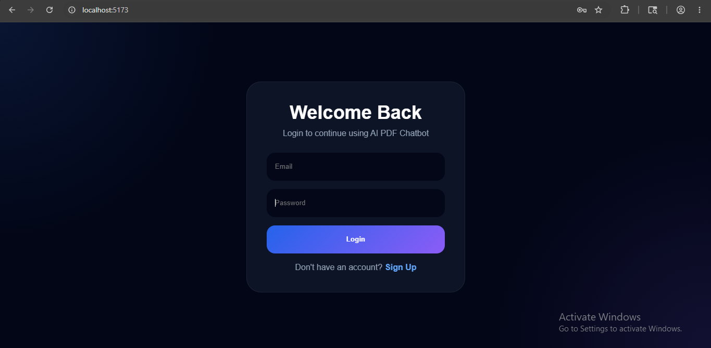
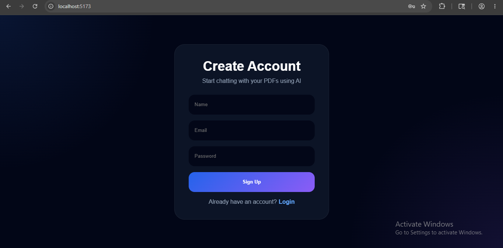
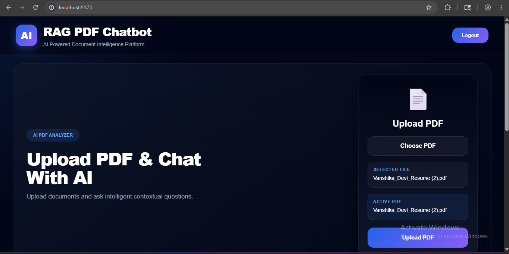
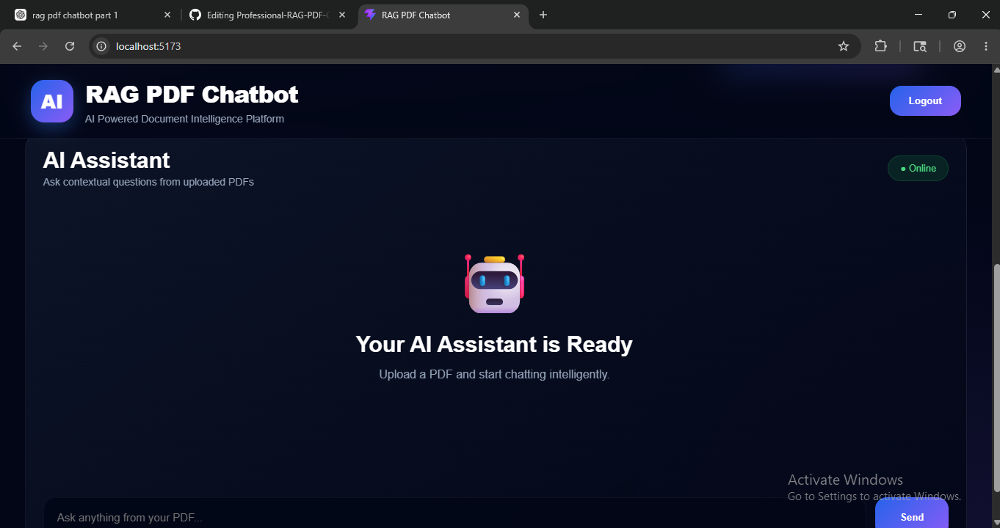

# 🚀 RAG PDF Chatbot

An AI-powered **RAG (Retrieval-Augmented Generation) PDF Chatbot** built using **FastAPI, React, LangChain, ChromaDB, and Ollama**.

This application allows users to upload a PDF and intelligently chat with the document using local AI models.

The system supports:

- 📄 Resumes
- 📚 Notes
- 📑 Assignments
- 📖 Research Papers
- 🧾 OCR PDFs
- 💻 Technical Documentation

---

# 🚀 Key Highlights

- Universal Single-Document PDF Question Answering
- OCR Support for Scanned PDFs
- JWT Authentication System
- Semantic Search using ChromaDB
- Local LLM Inference with Phi3
- Works Fully Offline
- Optimized for Low-End PCs (8GB RAM)
- AI-Powered Contextual Understanding
- Resume & Notes Intelligence System

---

# ✨ Features

- 🔐 JWT Authentication System
- 📄 Upload and process PDFs
- 🤖 AI-powered contextual question answering
- 🧠 Retrieval-Augmented Generation (RAG)
- 🔎 Semantic search using vector embeddings
- 🗂 ChromaDB vector database
- 🖼 OCR support for scanned PDFs
- 💬 Modern responsive chat interface
- ⚡ FastAPI backend
- 🎨 React frontend with modern UI
- 🧩 LangChain integration
- 🖥 Local LLM support using Ollama + Phi3
- 📚 Universal single-document PDF understanding
- 🔍 Resume information extraction
- 🧾 Technical note understanding
- 📑 Research paper summarization
- 🔒 Protected API routes using JWT
- 📂 Local PDF storage system
- 🧠 Semantic chunk retrieval pipeline

---

# 🐍 Python Version

Recommended Python version:

```txt
Python 3.11.9
```

This project was tested using Python 3.11 with LangChain, ChromaDB, FastAPI, and Ollama.

---

# 📸 Screenshots

## Login Page

Modern JWT authentication login system.



---

## Signup Page

Secure user registration interface.



---

## Home Page

Main landing page for uploading PDFs and interacting with AI.



---

## Chat Interface

Real-time AI-powered contextual conversations with uploaded PDFs.



---

# 📂 Additional Screenshots

More technical screenshots and AI response examples are available here:

👉 [View Additional Screenshots](screenshots/README.md)

---

# 🛠 Tech Stack

## Frontend

- React.js
- Vite
- JavaScript (ES6+)
- Axios
- Framer Motion
- React Hot Toast
- CSS3
- Responsive UI Design
- Local Storage Authentication
- Component-Based Architecture

---

## Backend

- FastAPI
- Python
- REST APIs
- JWT Authentication
- Python-Jose
- Passlib
- Bcrypt
- MongoDB
- PyMongo
- Python Dotenv
- Pydantic
- Uvicorn

---

## AI / RAG Stack

- LangChain
- Retrieval-Augmented Generation (RAG)
- ChromaDB Vector Database
- Semantic Search
- HuggingFace Embeddings
- Sentence Transformers
- RecursiveCharacterTextSplitter
- RetrievalQA Chain
- Ollama
- Phi3 LLM

---

## PDF Processing & OCR

- PyMuPDF (fitz)
- OCR Text Extraction
- Pytesseract
- Pillow (PIL)
- PDF Chunking
- Semantic Embedding Generation

---

# 🧠 AI Capabilities

- Contextual Question Answering
- Semantic Retrieval
- Resume Parsing
- Notes Question Answering
- OCR-based Document Understanding
- Technical Document QA
- AI-powered Summarization
- Semantic Context Matching

---

# 🧠 How It Works

## Step 1 — Upload PDF

The uploaded PDF is stored inside:

```bash
backend/uploads/
```

---

## Step 2 — Extract Text

The backend extracts text using:

- PyMuPDF
- OCR fallback using Tesseract for scanned PDFs

---

## Step 3 — Chunking

The document is split into semantic chunks using:

```python
RecursiveCharacterTextSplitter
```

Configuration used:

```python
chunk_size=500
chunk_overlap=80
```

---

## Step 4 — Generate Embeddings

Embeddings are created using:

```python
sentence-transformers/all-MiniLM-L6-v2
```

---

## Step 5 — Store in ChromaDB

Embeddings are stored in:

```bash
backend/chroma_db/
```

---

## Step 6 — Ask Questions

User questions are semantically matched against stored chunks.

The relevant context is sent to the Phi3 model through Ollama.

---

# ⚠️ Current Limitation

Currently, the system supports:

```txt
One active PDF at a time
```

Uploading a new PDF replaces the previous active vector database for retrieval.

However, uploaded PDFs are still physically stored inside:

```bash
backend/uploads/
```

Multi-PDF support is planned as a future improvement.

---

# 📂 Project Structure

```bash
rag-pdf-chatbot/
│
├── backend/
│   ├── app/
│   │   ├── api/
│   │   ├── auth/
│   │   ├── core/
│   │   ├── database/
│   │   ├── models/
│   │   ├── services/
│   │   └── utils/
│   │
│   ├── uploads/
│   ├── chroma_db/
│   ├── requirements.txt
│   └── .env
│
├── frontend/
│   ├── src/
│   │   ├── api/
│   │   ├── components/
│   │   ├── pages/
│   │   └── styles/
│   │
│   ├── App.jsx
│   ├── main.jsx
│   ├── package.json
│   └── vite.config.js
│
├── screenshots/
│   ├── README.md
│   ├── login-page.png
│   ├── signup-page.png
│   ├── home-page.png
│   ├── chat-interface.png
│   └── ai-response-1.png
│
├── .gitignore
└── README.md
```

---

# ⚙️ Backend Setup

## 1. Navigate to Backend

```bash
cd backend
```

---

## 2. Create Virtual Environment

```bash
python -m venv venv
```

---

## 3. Activate Virtual Environment

### Windows

```bash
venv\Scripts\activate
```

### Mac/Linux

```bash
source venv/bin/activate
```

---

## 4. Install Dependencies

```bash
pip install -r requirements.txt
```

---

## 5. Install Ollama

Download Ollama:

👉 https://ollama.com

---

## 6. Pull Phi3 Model

```bash
ollama pull phi3
```

---

## 7. Create `.env`

Inside:

```bash
backend/.env
```

Add:

```env
OLLAMA_MODEL=phi3

MONGO_URL=mongodb://localhost:27017

DATABASE_NAME=rag_pdf_chatbot

SECRET_KEY=mysecretkey123

ALGORITHM=HS256
```

---

## 8. Run Backend

```bash
uvicorn app.main:app --reload
```

Backend runs on:

```bash
http://127.0.0.1:8000
```

---

# 💻 Frontend Setup

## 1. Navigate to Frontend

```bash
cd frontend
```

---

## 2. Install Dependencies

```bash
npm install
```

---

## 3. Run Frontend

```bash
npm run dev
```

Frontend runs on:

```bash
http://localhost:5173
```

---

# 🔐 Authentication Features

- User Signup
- User Login
- JWT Token Authentication
- Protected API Routes
- Secure Password Hashing

---

# 🤖 Supported Question Types

## Resume Questions

```txt
What is the candidate name?
What skills are mentioned?
What projects are listed?
What is the CGPA?
What technologies are used?
```

---

## Notes Questions

```txt
Explain cache coherence.
What is pipelining?
Explain checksum method.
Explain Amdahl’s Law.
```

---

## Research PDFs

```txt
Summarize the paper.
What methodology is used?
What are the conclusions?
```

---

# 🚀 API Endpoints

## Auth Routes

### Signup

```http
POST /signup
```

### Login

```http
POST /login
```

---

## PDF Routes

### Upload PDF

```http
POST /upload
```

### Ask Question

```http
POST /ask
```

---

# 🔥 Future Improvements

- Multi-PDF support
- Chat history
- Streaming AI responses
- Source citations
- Cloud deployment
- User-specific vector databases
- Drag and drop upload
- PDF preview
- Speech-to-text input
- AI-generated summaries
- PDF highlighting

---

# 🧪 Example Workflow

1. User logs in
2. Uploads a PDF
3. PDF text is extracted
4. Embeddings are generated
5. Chunks stored in ChromaDB
6. User asks questions
7. AI answers using document context

---

# 🧠 AI Model

This project uses:

```txt
Phi3 via Ollama
```

Optimized for low-end laptops with 8GB RAM.

---

# 👩‍💻 Author

## Vanshika Devi

GitHub:

👉 https://github.com/Vanshika-devi

---

# ⭐ If You Like This Project

Give this repository a star ⭐ on GitHub.
